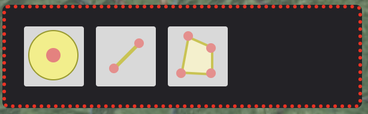
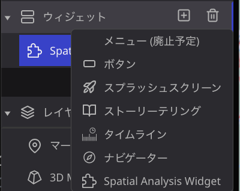
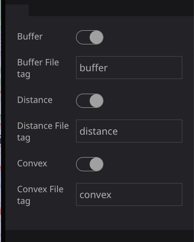
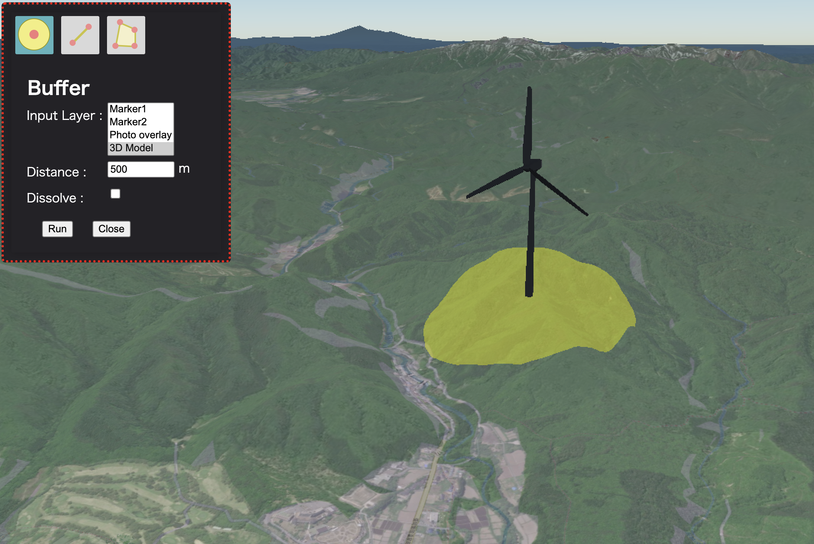
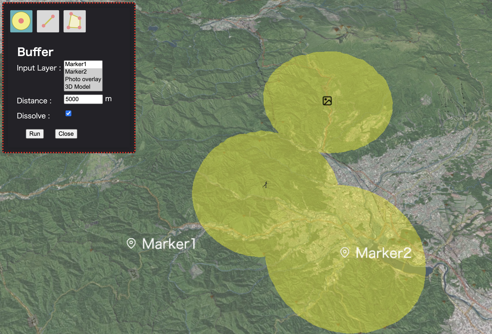
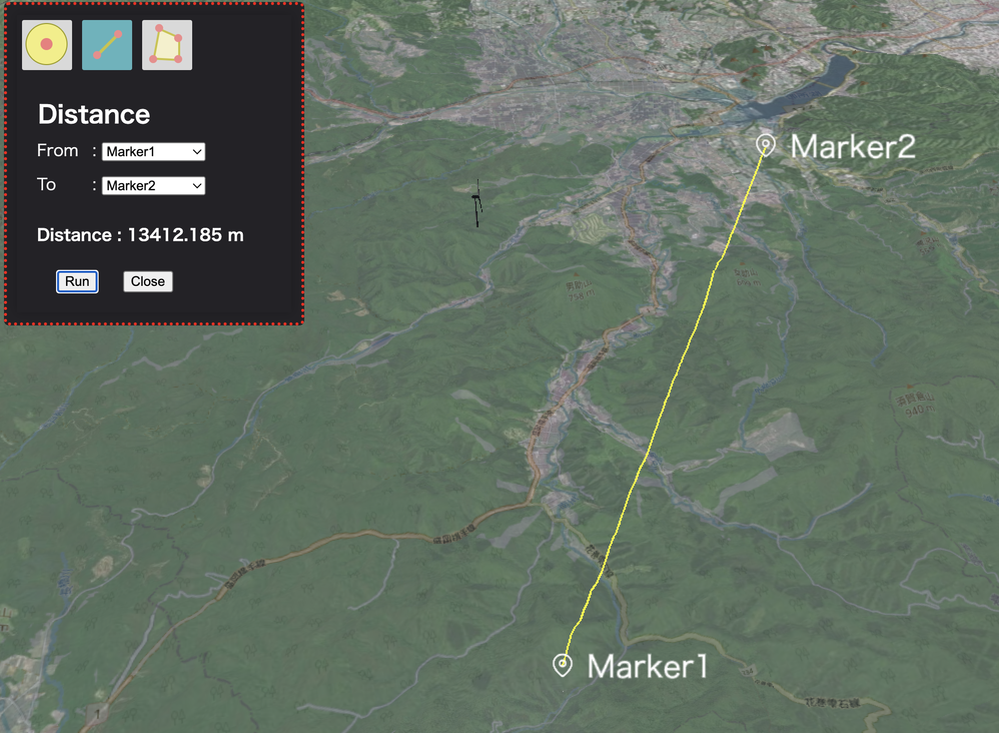
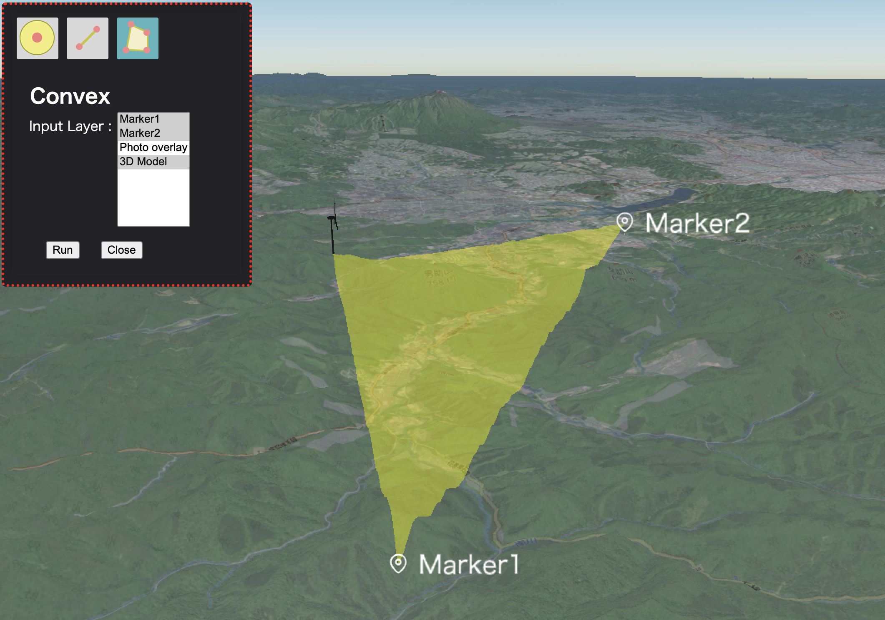

# spatial-analysis-plugin

## このプラグインについて

このプラグインはマップに追加しているポイントや3Dモデルなどのレイヤの地点に対して、任意の距離の干渉域を算出するBuffer、２地点間の距離を算出するDistance、複数地点の複数地点に対する凸包ポリゴンを作成するconvexの3つの空間処理機能を提供しています。

## 設定方法
- プラグインをインストールしたら、ウィジェットから「Spatial Analysis Widget」を追加して、使用することができるようになります。

- プラグインの設定項目では、プロジェクト内で使用したい処理を選択することができます。使用したい処理のトグルをオンにしてください。また、それぞれの処理に使用したいレイヤタグを指定します。マーカーや3Dモデルなどのレイヤにあらかじめ同名のタグを指定しておいてください。

## 使い方
- Buffer
  - input Layerの選択肢からバッファ発生源のレイヤを指定します。
  - Distanceにバッファの半径距離を入力します。
  - [Run]をクリックするとバッファが発生されます。
   

  - input LayerはShiftキーもしくはctrlキーを押しながら選択することで複数指定することができます。
  - Dissolveにチェックを入れると、バッファが重なっている領域を統合（ディソルブ）します。
  - 

- Distance
  - 2地点間の距離を算出します。
  - FromとToを指定し、[Run]をクリックすると、FromとToの間の距離とラインを表示します。
   

- Convex
  - 指定した地点を結ぶ凸包ポリゴンを作成します。
  - input Layerからポリゴンの頂点となる地点を選択します。input LayerはShiftキーもしくはctrlキーを押しながら選択することで複数指定することができます。
  - [Run]をクリックするとせんたkすいた地点を結ぶポリゴンが表示されます。

   
